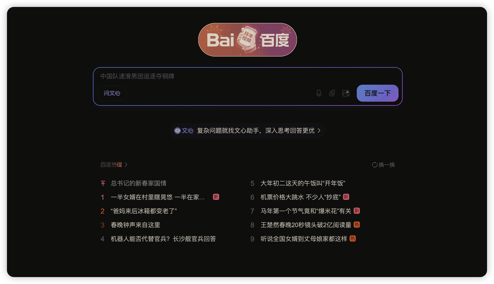

# 🌙 DarkMode Pro - 智能夜间模式

[](https://chrome.google.com/webstore)
[](LICENSE)
[](https://github.com/leapx-ai/darkmode-pro/releases)
[](https://github.com/leapx-ai/darkmode-pro)

> 一键开启夜间模式，智能保护视力。自动识别网页内容，低侵入、高性能的暗黑模式体验。

<p align="center">
  
</p>

<p align="center">
  
</p>

<p align="center">
  <a href="https://chrome.google.com/webstore" target="_blank">
    
  </a>
</p>

---

## ✨ 特性

- 🌙 **智能反转** - 自动保护图片、视频、Canvas 等元素，保持原始色彩
- ⚡ **零延迟** - 纯 CSS 方案，页面加载瞬间生效，无闪烁
- 🎨 **个性定制** - 亮度、对比度、暖色调自由调节
- 🔄 **自动跟随** - 根据系统主题偏好自动切换
- ⌨️ **快捷键支持** - Alt+Shift+D 快速切换
- 🛡️ **低侵入性** - 不影响网页原有功能和性能
- 📱 **全平台** - 支持 Windows、macOS、Linux
- 🆓 **完全免费** - 开源项目，MIT 协议

---

## 🚀 快速开始

### 安装依赖

```bash
npm install
```

### 开发模式（热重载）

```bash
npm run dev
```

文件变更后会自动重新编译。

### 生产构建

```bash
npm run build
```

代码会自动压缩优化，输出到 `dist/` 目录。

### 打包为 ZIP

```bash
npm run zip
```

生成发布包 `releases/darkmode-pro-v1.0.0.zip`

---

## 📖 使用指南

### 开发者模式安装

1. 执行 `npm run build` 构建扩展
2. 打开 Chrome 扩展管理页：`chrome://extensions/`
3. 开启右上角「开发者模式」
4. 点击「加载已解压的扩展程序」
5. 选择 `dist/` 文件夹

### 快速开始

1. **开启夜间模式**
   - 点击浏览器工具栏的 🌙 图标
   - 或使用快捷键 `Alt + Shift + D`

2. **调节参数**
   - 点击图标打开控制面板
   - 拖动滑块调节亮度、对比度等参数

3. **应用到所有标签页**
   - 点击控制面板中的「全部应用」按钮

---

## 📁 项目结构

```
darkmode-extension/
├── src/                      # 源代码
│   ├── js/                   # JavaScript 文件
│   │   ├── content.js        # 内容脚本（核心逻辑）
│   │   ├── background.js     # 后台服务
│   │   └── popup.js          # 弹出面板逻辑
│   ├── css/                  # 样式文件
│   │   └── popup.css         # 弹出面板样式
│   ├── html/                 # HTML 文件
│   │   └── popup.html        # 弹出面板
│   ├── icons/                # 图标资源
│   └── manifest.json         # 扩展配置
├── public/                   # 公共资源（图标源文件）
├── docs/                     # GitHub Pages 文档
├── dist/                     # 构建输出（自动生成）
├── releases/                 # ZIP 发布包（自动生成）
├── scripts/                  # 构建脚本
├── webpack.config.js         # Webpack 配置
└── package.json              # 项目依赖
```

---

## 🛠️ 技术实现

### 核心原理

DarkMode Pro 采用 **CSS Filter 智能反转** 方案：

```css
html[data-darkmode-pro="on"] {
  filter: invert(1) hue-rotate(180deg) brightness(100%) contrast(100%);
}

/* 保护图片/视频不被反转 */
html[data-darkmode-pro="on"] img,
html[data-darkmode-pro="on"] video {
  filter: invert(1) hue-rotate(180deg) brightness(100%) contrast(100%);
}
```

### 性能优化

- **零 JavaScript 依赖渲染** - 核心样式使用纯 CSS
- **懒加载** - 动态内容使用 `MutationObserver` 延迟处理
- **GPU 加速** - 利用 `filter` 硬件加速特性
- **代码压缩** - Webpack + Terser 自动压缩

---

## 🤝 贡献

欢迎提交 Issue 和 Pull Request！

### 开发流程

1. Fork 本仓库
2. 创建功能分支：`git checkout -b feature/amazing-feature`
3. 提交更改：`git commit -m 'Add amazing feature'`
4. 推送分支：`git push origin feature/amazing-feature`
5. 创建 Pull Request

### 代码规范

- 使用 ESLint 检查代码
- 提交前运行 `npm run build` 确保无错误
- 保持代码简洁，添加必要注释

---

## 📝 更新日志

### [1.0.0] - 2024-02-17

- ✨ 初始版本发布
- 🌙 智能夜间模式
- 🎨 自定义滤镜参数
- 🔄 系统主题自动跟随
- ⌨️ 快捷键支持
- 📦 Webpack 构建系统

---

## 🔐 隐私说明

DarkMode Pro 重视您的隐私：

- ✅ **不收集任何用户数据**
- ✅ **不上传任何信息**
- ✅ **所有设置保存在本地**
- ✅ **开源透明，可审计**

---

## 📄 许可证

本项目基于 [MIT](LICENSE) 协议开源。

---

## 🙏 鸣谢

- 感谢所有贡献者
- 灵感来源于 [Dark Reader](https://darkreader.org/)
- 图标设计基于开源资源

---

<p align="center">
  <sub>Built with ❤️ for night owls everywhere</sub>
</p>
